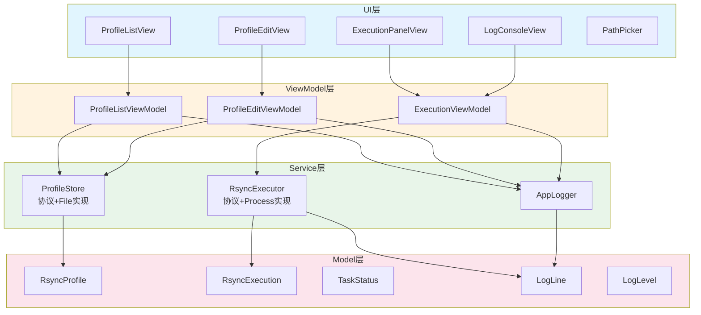
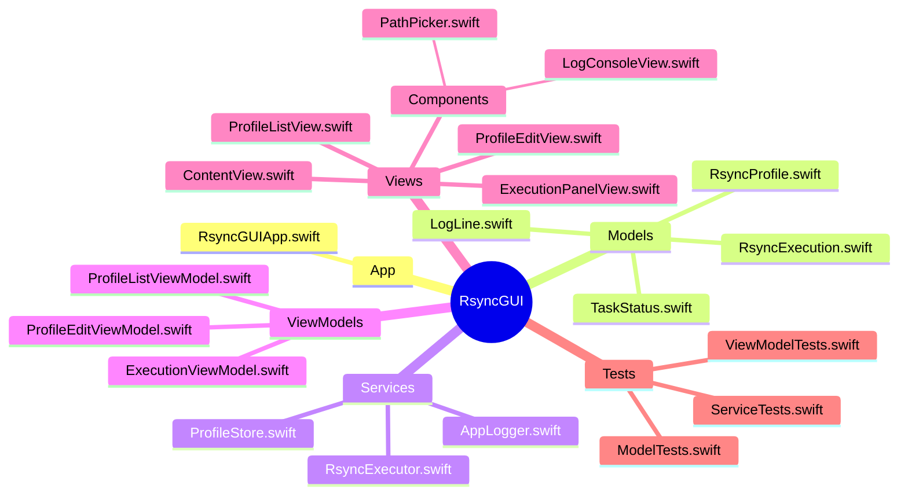

# RsyncGUI 架构设计

## 1. 设计目标

RsyncGUI 是一个基于 SwiftUI 的 macOS 桌面应用，用于可视化管理和执行 rsync 同步任务。架构设计遵循以下核心原则：

- **分层解耦**: Model / Service / ViewModel / View 严格分层
- **测试驱动 (TDD)**: 每层都有对应的单元测试覆盖
- **数据驱动 UI**: UI 完全由状态驱动，无直接业务逻辑
- **结构化日志**: 应用日志与执行日志分离，支持实时观察

项目地址: https://github.com/olojiang/rsync_gui
Releases: https://github.com/olojiang/rsync_gui/releases

---

## 2. 分层架构



---

## 3. 各层职责

| 层级 | 核心职责 | 关键技术 |
|------|---------|---------|
| **Model** | 纯数据定义，无行为逻辑 | `Codable`, `Equatable`, `Sendable` |
| **Service** | 业务逻辑、I/O、进程管理 | `actor`, `Process`, `FileManager` |
| **ViewModel** | 状态管理、用户意图转换 | `@MainActor`, `ObservableObject`, `@Published` |
| **View** | UI 渲染、用户交互 | `SwiftUI`, `NavigationSplitView` |

---

## 4. 依赖方向

依赖关系始终向下，禁止跨层直接访问：

```
View → ViewModel → Service → Model
```

`AppLogger` 作为跨层基础设施，所有层均可调用，但只写入不读取（读取通过 `AsyncStream` 观察器）。

---

## 5. 技术选型说明

| 技术 | 选型 | 理由 |
|------|------|------|
| 构建系统 | Swift Package Manager | 简洁、无 Xcode 项目文件、依赖管理原生支持 |
| UI 框架 | SwiftUI | 原生 macOS 体验、声明式、与 Combine 深度集成 |
| 状态管理 | `@Published` + `ObservableObject` | 数据驱动、测试友好 |
| 并发模型 | `actor` + `@MainActor` | Swift 6 严格并发安全、编译期数据竞争检测 |
| 持久化 | JSON 文件 | 轻量、可控、无需 Core Data 复杂度 |
| 进程执行 | `Foundation.Process` | 标准库支持、实时 Pipe 输出 |
| 日志 | 自研结构化 Logger | 内存环形缓冲 + OSLog + AsyncStream 观察 |
| 打包 | `scripts/build_app.sh` | 生成包含 AppIcon 的 macOS `.app` bundle |

---

## 6. 模块清单


