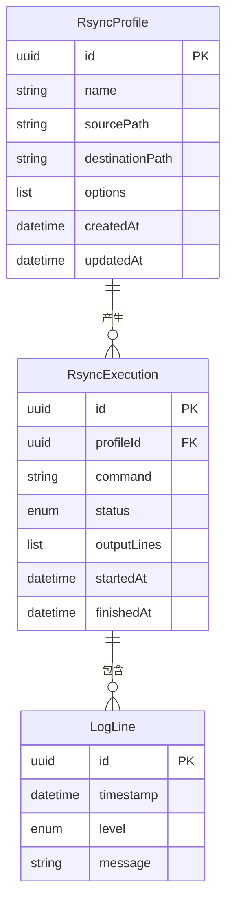
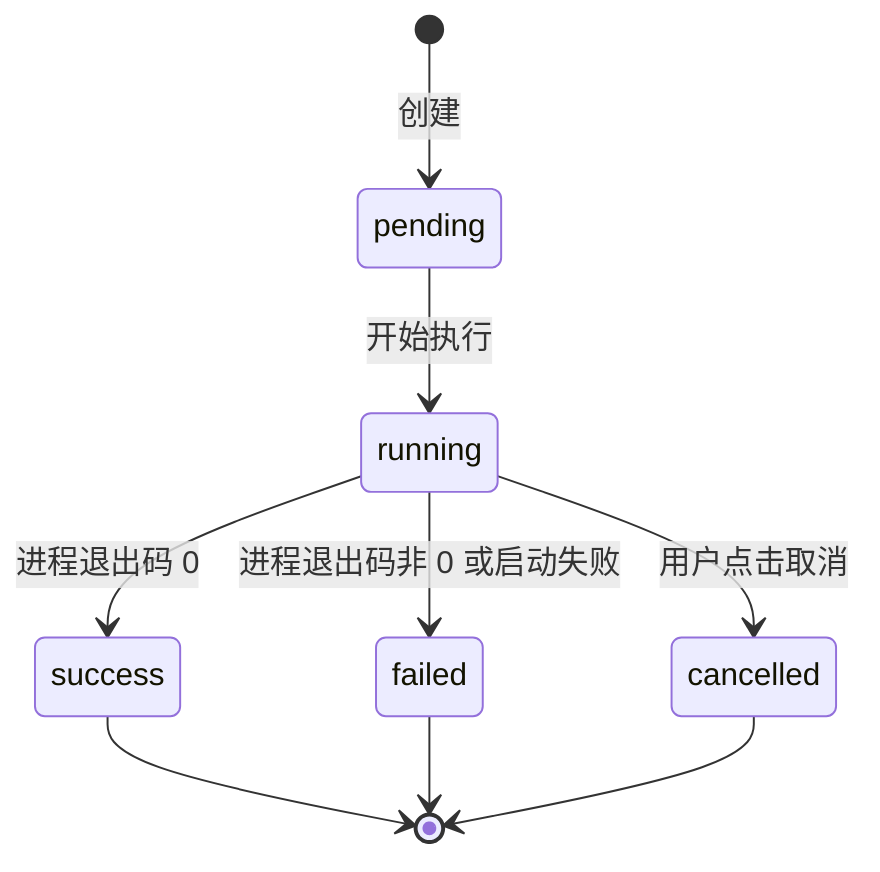
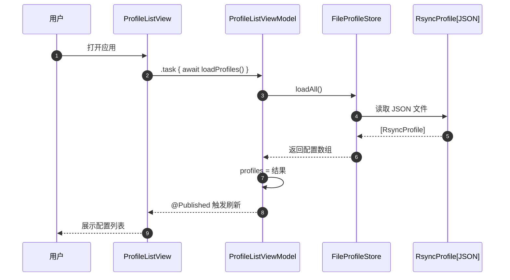
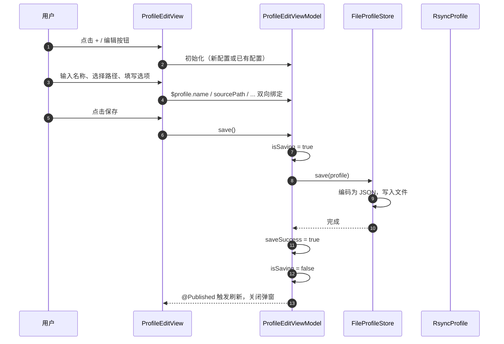
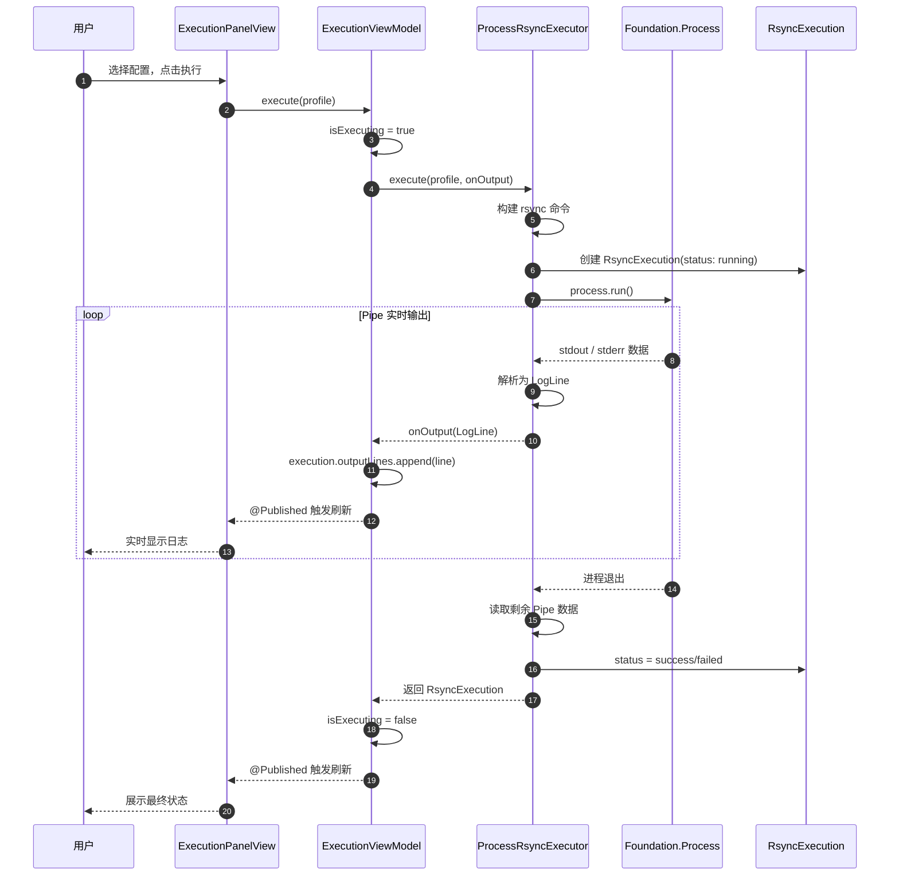
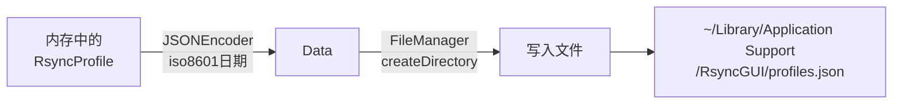
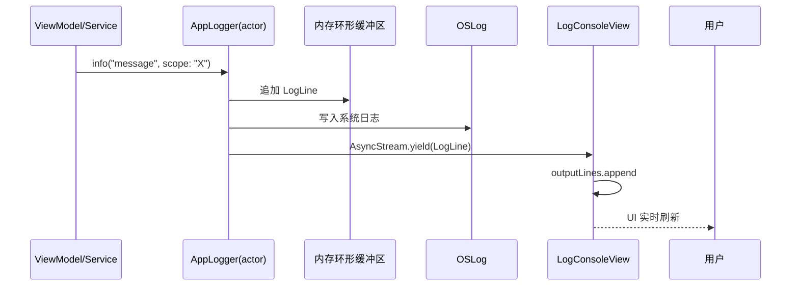

# 数据模型与数据流

## 1. 数据模型

### 1.1 实体关系图 (ER)



### 1.2 状态机图

`RsyncExecution` 的生命周期状态流转：



---

## 2. 核心数据流

### 2.1 配置加载与展示



### 2.2 配置编辑与保存



### 2.3 rsync 执行与实时日志



---

## 3. 数据持久化

### 3.1 存储位置

```
~/Library/Application Support/RsyncGUI/profiles.json
```

### 3.2 JSON 结构示例

```json
[
  {
    "id": "550e8400-e29b-41d4-a716-446655440000",
    "name": "Documents Backup",
    "sourcePath": "/Users/me/Documents",
    "destinationPath": "/Users/me/Backups/Documents",
    "options": ["-avz", "--delete"],
    "createdAt": "2026-05-02T10:00:00Z",
    "updatedAt": "2026-05-02T10:00:00Z"
  }
]
```

### 3.3 存储流程



---

## 4. 日志数据流


