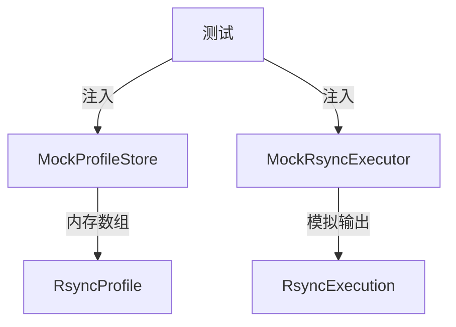

# 核心代码说明

## 1. 模型层 (Model)

### 1.1 RsyncProfile — 配置档案

**文件**: `Sources/RsyncGUI/Models/RsyncProfile.swift`

```swift
struct RsyncProfile: Identifiable, Codable, Equatable, Sendable {
    let id: UUID
    var name: String
    var sourcePath: String
    var destinationPath: String
    var options: [String]
    let createdAt: Date
    var updatedAt: Date

    func buildCommand() -> [String] {
        var command = ["rsync"]
        command.append(contentsOf: options)
        command.append(sourcePath)
        command.append(destinationPath)
        return command
    }
}
```

**设计要点**:
- `Identifiable`: 支持 SwiftUI `ForEach` 直接使用
- `Codable` + `iso8601` 日期策略: 与 JSON 文件持久化无缝衔接
- `Sendable`: Swift 6 严格并发安全
- `buildCommand()`: 将结构化数据转换为可执行的命令数组，是 Model 向 Service 的边界转换逻辑

### 1.2 TaskStatus — 执行状态枚举

**文件**: `Sources/RsyncGUI/Models/TaskStatus.swift`

```swift
enum TaskStatus: String, Codable, Equatable, Sendable {
    case pending, running, success, failed, cancelled
}
```

**设计要点**:
- 使用 `String` 作为 `RawValue`，便于 JSON 序列化和人类阅读
- 覆盖 rsync 执行的所有可能终态

---

## 2. 服务层 (Service)

### 2.1 FileProfileStore — 配置持久化

**文件**: `Sources/RsyncGUI/Services/ProfileStore.swift`

```swift
protocol ProfileStoreProtocol: Sendable {
    func loadAll() async throws -> [RsyncProfile]
    func save(_ profile: RsyncProfile) async throws
    func delete(id: UUID) async throws
}

actor FileProfileStore: ProfileStoreProtocol {
    let fileURL: URL

    func loadAll() async throws -> [RsyncProfile] { ... }
    func save(_ profile: RsyncProfile) async throws { ... }
    func delete(id: UUID) async throws { ... }
}
```

**设计要点**:
- **协议抽象**: `ProfileStoreProtocol` 使 ViewModel 和测试可以注入 Mock 实现
- **actor 隔离**: 所有文件 I/O 操作在 actor 隔离域内执行，天然线程安全
- **幂等保存**: `save()` 自动处理「新增」和「更新」两种情况，通过 `id` 判断
- **自动建目录**: 首次保存时自动创建 `Application Support/RsyncGUI` 目录

### 2.2 ProcessRsyncExecutor — rsync 执行器

**文件**: `Sources/RsyncGUI/Services/RsyncExecutor.swift`

```swift
actor ProcessRsyncExecutor: RsyncExecutorProtocol {
    private var activeProcesses: [UUID: Process] = [:]

    func execute(profile: RsyncProfile, onOutput: @escaping @Sendable (LogLine) -> Void) async -> RsyncExecution { ... }
    func cancel(executionId: UUID) async { ... }
}
```

**设计要点**:
- **多路径探测**: 依次探测 `/usr/bin/rsync`、`/usr/local/bin/rsync`、`/opt/homebrew/bin/rsync`，兼容不同安装方式
- **Pipe 实时输出**: 使用 `FileHandle.readabilityHandler` 实时捕获 stdout/stderr，转化为 `LogLine` 通过回调推送
- **数据排空**: `waitUntilExit()` 后再次读取 Pipe 剩余数据，避免丢日志
- **状态跟踪**: `activeProcesses` 字典维护运行中的进程，支持取消操作

**关键边界处理**:

| 场景 | 处理方式 |
|------|---------|
| rsync 未安装 | 立即返回 `failed` 状态，并输出错误日志 |
| 路径含空格 | `Process.arguments` 自动处理，无需手动转义 |
| 进程启动失败 | `catch` 块捕获，状态置为 `failed` |
| 用户取消 | `process.terminate()` 发送 SIGTERM，`waitUntilExit()` 立即返回 |

### 2.3 AppLogger — 结构化日志

**文件**: `Sources/RsyncGUI/Services/AppLogger.swift`

```swift
actor AppLogger {
    static let shared = AppLogger()
    private var buffer: [LogLine] = []
    private var continuations: [UUID: AsyncStream<LogLine>.Continuation] = [:]
    private let maxBufferSize = 1000

    func info(_ message: String, scope: String = "") { ... }
    func observe() -> AsyncStream<LogLine> { ... }
    func recentLogs(limit: Int = 100) -> [LogLine] { ... }
}
```

**设计要点**:
- **单例模式**: `shared` 作为全局访问点，但仍是 actor，保证线程安全
- **双目标输出**: 同时写入 OSLog（系统日志）和内存环形缓冲区（UI 展示）
- **观察器模式**: `AsyncStream` 支持多订阅者实时接收日志，无需轮询
- **自动淘汰**: 缓冲区超过 1000 条时自动移除最旧的日志，防止内存无限增长

---

## 3. ViewModel 层

### 3.1 ProfileListViewModel — 配置列表管理

**文件**: `Sources/RsyncGUI/ViewModels/ProfileListViewModel.swift`

```swift
@MainActor
final class ProfileListViewModel: ObservableObject {
    @Published var profiles: [RsyncProfile] = []
    @Published var selectedProfileId: UUID?
    @Published var errorMessage: String?
    ...
}
```

**设计要点**:
- `@MainActor`: 所有状态更新保证在主线程，SwiftUI 安全
- `@Published`: 状态变更自动驱动 UI 刷新
- 错误状态通过 `errorMessage` 暴露，由 View 负责展示 `alert`

### 3.2 ExecutionViewModel — 执行控制

**文件**: `Sources/RsyncGUI/ViewModels/ExecutionViewModel.swift`

```swift
@MainActor
final class ExecutionViewModel: ObservableObject {
    @Published var execution: RsyncExecution?
    @Published var isExecuting = false

    func execute(profile: RsyncProfile) async {
        let result = await executor.execute(profile: profile) { [weak self] line in
            Task { @MainActor [weak self] in
                self?.execution?.outputLines.append(line)
            }
        }
        self.execution = result
    }
}
```

**设计要点**:
- **闭包线程安全**: `onOutput` 回调在后台线程执行，通过 `Task { @MainActor }` 安全回写状态
- `[weak self]`: 防止 ViewModel 被持有导致内存泄漏
- `defer { isExecuting = false }`: 确保无论成功、失败还是异常，执行状态都会重置

---

## 4. 视图层 (View)

### 4.1 ContentView — 主窗口布局

**文件**: `Sources/RsyncGUI/Views/ContentView.swift`

使用 `NavigationSplitView` 构建经典 macOS 双栏布局：
- **左侧 (Sidebar)**: `ProfileListView`，固定宽度 200-240pt
- **右侧 (Detail)**: `ExecutionPanelView` 或 `EmptyStateView`

### 4.2 LogConsoleView — 日志控制台

**文件**: `Sources/RsyncGUI/Views/Components/LogConsoleView.swift`

```swift
struct LogConsoleView: View {
    let lines: [LogLine]

    var body: some View {
        ScrollViewReader { proxy in
            ScrollView {
                LazyVStack(alignment: .leading, spacing: 2) {
                    ForEach(lines) { line in
                        LogLineRow(line: line)
                            .id(line.id)
                    }
                }
            }
            .onChange(of: lines.count) { _ in
                if let last = lines.last {
                    proxy.scrollTo(last.id, anchor: .bottom)
                }
            }
        }
    }
}
```

**设计要点**:
- `LazyVStack`: 大量日志时性能优化
- `ScrollViewReader` + `scrollTo`: 新日志到达时自动滚动到底部
- `textSelection(.enabled)`: 支持用户选中复制日志内容
- 颜色编码: debug=灰色, info=主色, warning=橙色, error=红色

### 4.3 PathPicker — 路径选择

**文件**: `Sources/RsyncGUI/Views/Components/PathPicker.swift`

使用 `NSOpenPanel` 原生文件选择器，同时支持文件和目录选择。

---

## 5. 测试设计

### 5.1 Mock 策略



- `MockProfileStore`: 用内存数组代替文件 I/O，测试速度快、无副作用
- `MockRsyncExecutor`: 可配置执行结果（成功/失败）和预置输出，无需真实 rsync 进程

### 5.2 测试覆盖矩阵

| 层级 | 测试文件 | 覆盖范围 |
|------|---------|---------|
| Model | `ModelTests.swift` | Codable 编解码、Equatable、状态枚举、命令构建 |
| Service | `ServiceTests.swift` | 日志缓冲区、存储增删改查、执行器状态流转 |
| ViewModel | `ViewModelTests.swift` | 状态变更、加载/保存/删除/执行交互 |
