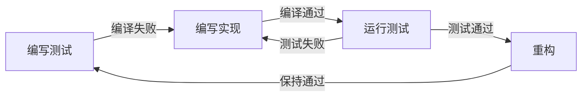
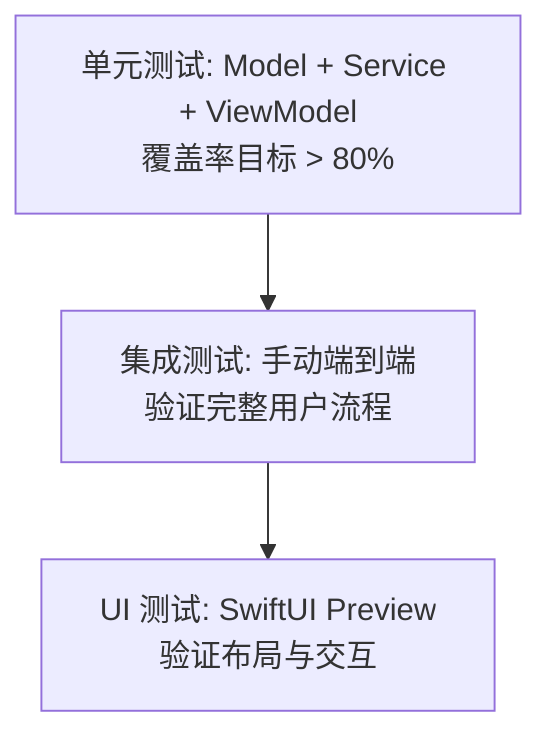

# 测试说明

## 1. 测试策略

RsyncGUI 采用 **TDD（测试驱动开发）** 方式构建，每层代码均先写测试、再写实现、最后重构。



### 1.1 测试金字塔



---

## 2. 测试结构

```
Tests/RsyncGUITests/
├── ModelTests.swift      # 模型层测试
├── ServiceTests.swift    # 服务层测试
└── ViewModelTests.swift  # ViewModel 层测试
```

---

## 3. 运行测试

### 3.1 命令行（需要完整 Xcode）

```bash
swift test
```

### 3.2 Xcode 中运行

1. 打开 `Package.swift`
2. 在 Test Navigator (Cmd+6) 中浏览所有测试
3. 点击单个测试旁的播放按钮运行
4. 或使用 `Cmd+U` 运行全部测试

### 3.3 当前环境限制说明

> 当前开发环境仅安装了 **Command Line Tools**，未安装完整 Xcode，因此 `swift test` 无法找到 `XCTest` 模块。
>
> 所有测试代码已按标准 XCTest 规范编写，可在安装了 Xcode 的 macOS 环境中直接运行。

---

## 4. 测试覆盖详情

### 4.1 ModelTests.swift

| 测试方法 | 测试目标 |
|---------|---------|
| `testTaskStatusRawValues` | 状态枚举原始值正确 |
| `testTaskStatusDecodable` | JSON 反序列化成功 |
| `testTaskStatusInvalidDecoding` | 非法值抛出异常 |
| `testLogLevelRawValues` | 日志级别原始值正确 |
| `testLogLineCreation` | 日志行初始化正确 |
| `testLogLineEquatable` | 相同内容判定相等 |
| `testLogLineNotEqual` | 不同级别判定不等 |
| `testProfileCreation` | 配置默认值正确 |
| `testProfileCodableRoundTrip` | JSON 编解码一致性 |
| `testProfileEquatable` | 相同 ID 和内容判定相等 |
| `testProfileBuildCommand` | 命令构建含选项 |
| `testProfileBuildCommandWithEmptyOptions` | 空选项时不含多余参数 |
| `testExecutionCreation` | 执行记录默认值正确 |
| `testExecutionStatusTransition` | 状态可变更 |
| `testExecutionAppendLog` | 日志可追加 |

### 4.2 ServiceTests.swift

| 测试方法 | 测试目标 |
|---------|---------|
| `testLoggerInfo` | 单条日志记录成功 |
| `testLoggerMultipleLevels` | 多级别日志顺序正确 |
| `testLoggerRecentLogsLimit` | 缓冲区限流生效 |
| `testLoggerObserve` | AsyncStream 观察器接收正常 |
| `testLoadAllEmpty` | 空目录返回空数组 |
| `testSaveAndLoad` | 保存后加载一致 |
| `testDelete` | 删除后数据消失 |
| `testUpdateExisting` | 更新同名配置生效 |
| `testExecuteEcho` | 执行器能完成并返回状态 |
| `testExecuteBuildsCorrectCommand` | 命令数组构建正确 |
| `testCancel` | 取消操作不崩溃 |

### 4.3 ViewModelTests.swift

| 测试方法 | 测试目标 |
|---------|---------|
| `testProfileListLoadEmpty` | 空存储展示空列表 |
| `testProfileListLoadWithData` | 有数据时正确加载 |
| `testProfileListDelete` | 删除后列表更新 |
| `testProfileListSelect` | 选择状态变更 |
| `testEditViewModelNewProfile` | 新建模式默认值正确 |
| `testEditViewModelExistingProfile` | 编辑模式加载已有数据 |
| `testEditViewModelSave` | 保存成功状态更新 |
| `testEditViewModelUpdate` | 更新后存储数据变更 |
| `testExecutionSuccess` | 成功执行状态正确 |
| `testExecutionFailure` | 失败执行状态正确 |
| `testExecutionCancel` | 取消操作不崩溃 |

---

## 5. Mock 对象说明

### 5.1 MockProfileStore

**文件**: `Tests/RsyncGUITests/ViewModelTests.swift`

```swift
actor MockProfileStore: ProfileStoreProtocol {
    var profiles: [RsyncProfile] = []
    func loadAll() async throws -> [RsyncProfile] { profiles }
    func save(_ profile: RsyncProfile) async throws { ... }
    func delete(id: UUID) async throws { ... }
}
```

- 使用**内存数组**替代真实文件 I/O
- 隔离测试副作用，确保测试可重复执行
- 支持并发（actor），与真实实现行为一致

### 5.2 MockRsyncExecutor

```swift
actor MockRsyncExecutor: RsyncExecutorProtocol {
    var shouldSucceed = true
    var outputsToSend: [String] = []

    func execute(profile: RsyncProfile, onOutput: ...) async -> RsyncExecution {
        for output in outputsToSend { onOutput(...) }
        return RsyncExecution(status: shouldSucceed ? .success : .failed)
    }
}
```

- 可配置执行结果（`shouldSucceed`）
- 可预置输出内容（`outputsToSend`）
- 无需真实 rsync 进程，测试速度快

---

## 6. 测试原则

1. **独立性**: 每个测试不依赖其他测试的执行顺序或副作用
2. **可重复性**: 任何时间、任何次数运行，结果一致
3. **快速性**: 不使用真实 I/O 或网络，全部使用 Mock
4. **明确性**: 测试方法名即文档，一眼看出测试目的
5. **单一职责**: 每个测试只验证一个概念或行为
